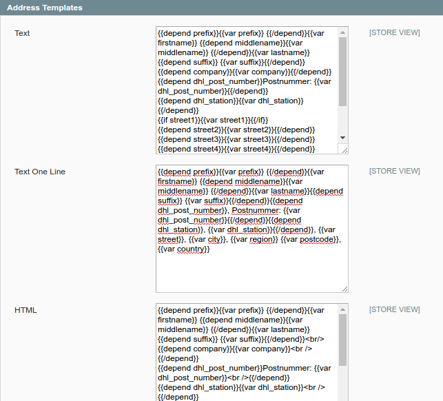
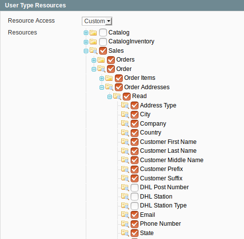
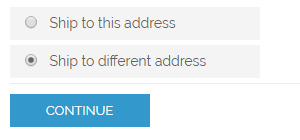
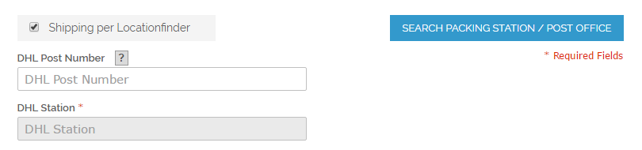
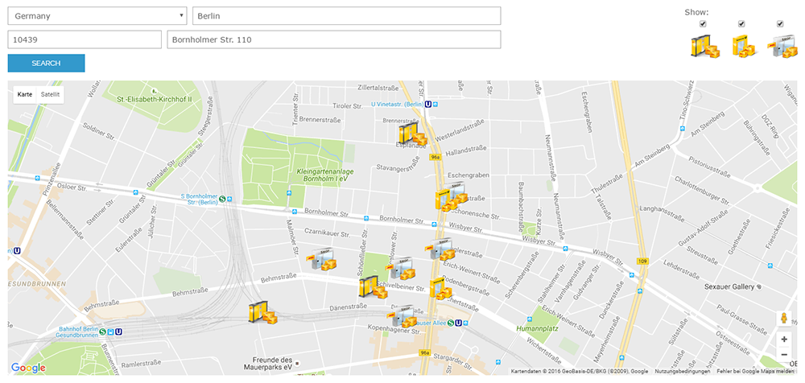
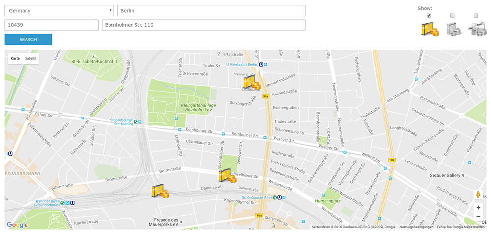
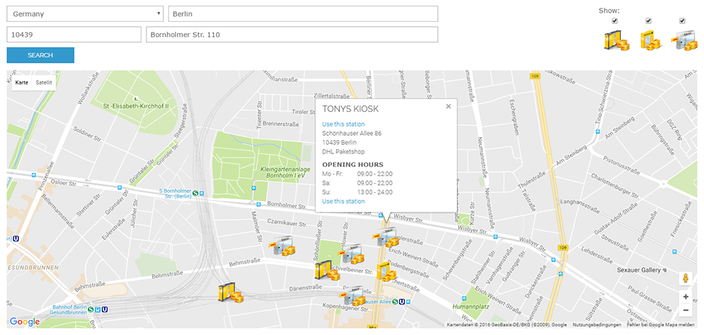
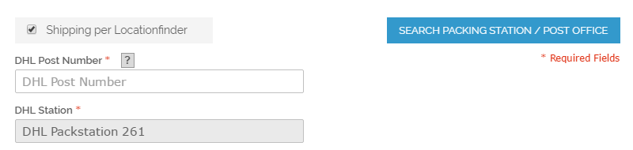

.. |date| date:: %d/%m/%Y
.. |year| date:: %Y

.. footer::
   .. class:: footertable

   +-------------------------+-------------------------+
   | Stand: |date|           | .. class:: rightalign   |
   |                         |                         |
   |                         | ###Page###/###Total###  |
   +-------------------------+-------------------------+

.. header::
   .. image:: images/dhl.jpg
      :width: 4.5cm
      :height: 1.2cm
      :align: right

.. sectnum::

===============================================================
DHL Lieferadressen: Adress-Suche von Packstationen und Filialen
===============================================================

Das Modul *DHL_LocationFinder* für Magento® ermöglicht es, DHL Abholstationen (Packstationen, Postfilialen und Paketshops) im
Magento® Checkout zu wählen und diese als Lieferadresse zu übernehmen. Das Modul nutzt dazu den von DHL bereitgestellten
Service Standortsuche API Europa.

Als synonyme Bezeichnungen gelten auch: DHL Standortsuche, DHL Location Finder, DHL Parcelshop Finder oder Postfinder.

.. contents:: Endbenutzer-Dokumentation

.. raw:: pdf

   PageBreak

Voraussetzungen
===============

Die nachfolgenden Voraussetzungen müssen für den reibungslosen Betrieb des Moduls erfüllt sein:

Magento®
--------

Folgende Magento®-Versionen werden vom Modul unterstützt:

- Community Edition 1.9
- Community Edition 1.8
- Community Edition 1.7

PHP
---

Folgende PHP-Versionen werden vom Modul unterstützt:

- PHP 7.0
- PHP 5.6
- PHP 5.5

Für die Anbindung der API muss die PHP SOAP Erweiterung auf dem Webserver installiert und aktiviert sein.

Google API Key
--------------

Das Modul verwendet Google Maps. Zur Nutzung ist ein Google Maps API Key notwendig. Im Regelfall genügt ein
kostenloser Key, siehe auch https://developers.google.com/maps/pricing-and-plans/#details

.. raw:: pdf

   PageBreak

Installation und Konfiguration
==============================

Im Folgenden wird beschrieben, wie das Modul installiert wird und welche
Konfigurationseinstellungen vorgenommen werden müssen.

Installation
------------

Installieren Sie die Dateien gemäß Ihrer bevorzugten Installations- und
Deployment-Strategie. Aktualisieren Sie den Konfigurations-Cache, damit die
Änderungen wirksam werden.

Beim ersten Aufruf des Moduls werden diese neuen Adress-Attribute im System angelegt:

- ``dhl_post_number``
- ``dhl_station_type``
- ``dhl_station``

Die Attribute werden in folgenden Tabellen hinzugefügt:

- ``sales_flat_quote_address``
- ``sales_flat_order_address``
- ``eav_attribute``

Modulkonfiguration
------------------

Öffnen Sie nach erfolgter Installation den Konfigurationsbereich:

::

    System → Konfiguration → Verkäufe → Zur Kasse

Dort finden Sie einen neuen Abschnitt "DHL Standortsuche" mit den für das Modul
relevanten Konfigurationseinstellungen.

.. list-table:: Konfigurationseinstellungen
   :widths: 3 2 7
   :header-rows: 1

   * - Konfiguration
     - Pflichtfeld / optional
     - Kommentar
   * - Google Maps API Key
     - Pflichtfeld
     - Zur Anzeige der DHL Abholstationen im Checkout wird die Google Maps API
       verwendet, die einen API Key erfordert.
   * - Suchergebnisse beschränken
     - optional
     - Dieses Feld legt fest, wie viele Ergebnisse auf der Karte angezeigt werden.
       Die Standortsuche API Europa liefert maximal 50 Abholstationen zurück.
   * - Zoom (Automatisch oder Festwert)
     - Pflichtfeld
     - Dieses Feld legt fest, ob die Karte im Checkout entsprechend den
       Suchergebnissen automatisch eingepasst oder ein fester Zoom-Faktor verwendet wird.
   * - Zoom-Faktor (nur bei Festwert)
     - Pflichtfeld
     - Wenn ein fester Zoom-Faktor verwendet werden soll, kann dieser hier
       festgelegt werden. Werte zwischen 9 und 15 sind möglich, wobei 15 der
       größte (detaillierteste) Zoom-Faktor ist.

.. raw:: pdf

   PageBreak

Einrichten der Adress-Templates
-------------------------------

Das Modul führt neue Adress-Attribute ein. Um diese auch im System anzuzeigen, ist es
evtl. erforderlich, die Adress-Templates um die neuen Attribute zu erweitern:

::

    System → Konfiguration → Kunden → Kundenkonfiguration → Addressvorlagen (Templates)

Im folgenden Ausschnitt sind die mit dem Modul ausgelieferten Standardvorlagen zu sehen:

Sollten Sie diesen Konfigurations-Abschnitt bereits verändert haben, müssen Sie
die Adress-Attribute manuell in Ihrer Systemkonfiguration ergänzen, z.B. so:

::

    {{depend dhl_post_number}}Postnummer: {{var dhl_post_number}}|{{/depend}}
    {{depend dhl_station}}{{var dhl_station}}|{{/depend}}

.. raw:: pdf

   PageBreak

Text:

::

    {{depend prefix}}{{var prefix}} {{/depend}}{{var firstname}} {{depend middlename}}{{var middlename}}
    {{/depend}}{{var lastname}}{{depend suffix}} {{var suffix}}{{/depend}}
    {{depend company}}{{var company}}{{/depend}}
    {{depend dhl_post_number}}Postnummer: {{var dhl_post_number}}{{/depend}}
    {{depend dhl_station}}{{var dhl_station}}{{/depend}}
    {{if street1}}{{var street1}}{{/if}}
    {{depend street2}}{{var street2}}{{/depend}}
    {{depend street3}}{{var street3}}{{/depend}}
    {{depend street4}}{{var street4}}{{/depend}}
    {{if city}}{{var city}}, {{/if}}{{if region}}{{var region}}, {{/if}}{{if postcode}}{{var postcode}}
    {{/if}}{{var country}}
    T: {{var telephone}}
    {{depend fax}}F: {{var fax}}{{/depend}}

Text One Line:

::

    {{depend prefix}}{{var prefix}} {{/depend}}{{var firstname}} {{depend middlename}}{{var middlename}}
    {{/depend}}{{var lastname}}{{depend suffix}} {{var suffix}}{{/depend}}{{depend dhl_post_number}},
    Postnummer: {{var dhl_post_number}}{{/depend}}{{depend dhl_station}}, {{var dhl_station}}{{/depend}},
    {{var street}}, {{var city}}, {{var region}} {{var postcode}}, {{var country}}

HTML:

::

    {{depend prefix}}{{var prefix}} {{/depend}}{{var firstname}} {{depend middlename}}{{var middlename}}
    {{/depend}}{{var lastname}}{{depend suffix}} {{var suffix}}{{/depend}} 
    {{depend company}}{{var company}} {{/depend}}
    {{depend dhl_post_number}}Postnummer: {{var dhl_post_number}} {{/depend}}
    {{depend dhl_station}}{{var dhl_station}} {{/depend}}
    {{if street1}}{{var street1}} {{/if}}
    {{depend street2}}{{var street2}} {{/depend}}
    {{depend street3}}{{var street3}} {{/depend}}
    {{depend street4}}{{var street4}} {{/depend}}
    {{if city}}{{var city}},  {{/if}}{{if region}}{{var region}}, {{/if}}{{if postcode}}{{var postcode}}
    {{/if}} {{var country}} 
    {{depend telephone}}T: {{var telephone}}{{/depend}}
    {{depend fax}} F: {{var fax}}{{/depend}}

PDF:

::

    {{depend prefix}}{{var prefix}} {{/depend}}{{var firstname}} {{depend middlename}}{{var middlename}}
    {{/depend}}{{var lastname}}{{depend suffix}} {{var suffix}}{{/depend}}|
    {{depend company}}{{var company}}|{{/depend}}
    {{depend dhl_post_number}}Postnummer: {{var dhl_post_number}}|{{/depend}}
    {{depend dhl_station}}{{var dhl_station}}|{{/depend}}
    {{if street1}}{{var street1}}{{/if}}
    {{depend street2}}{{var street2}}|{{/depend}}
    {{depend street3}}{{var street3}}|{{/depend}}
    {{depend street4}}{{var street4}}|{{/depend}}
    {{if city}}{{var city}},  {{/if}}{{if region}}{{var region}}, {{/if}}{{if postcode}}{{var postcode}}
    {{/if}}| {{var country}}|
    {{depend telephone}}T: {{var telephone}}{{/depend}}|
    {{depend fax}} F: {{var fax}}{{/depend}}

JavaScript Template:

::

    #{prefix} #{firstname} #{middlename} #{lastname} #{suffix} #{company} #{dhl_post_number},
    #{dhl_station} #{street0} #{street1} #{street2} #{street3} #{city}, #{region},
    #{postcode} #{country_id} T: #{telephone} F: #{fax}

.. raw:: pdf

   PageBreak

Hinweise zur Verwendung des Moduls
==================================

Erlaubte Länder
---------------

Derzeit werden folgende Länder durch Standortsuche API Europa unterstützt:

- Belgien
- Deutschland
- Niederlande
- Österreich
- Polen
- Slowakei
- Tschechien

Somit sind bei der Standortsuche im Checkout auch nur diese Länder verfügbar (oder weniger, je nach
Shop-Konfiguration).

Sprachunterstützung
-------------------

Das Modul unterstützt die Lokalisierungen ``en_US`` und ``de_DE``. Die Übersetzungen sind in den
CSV-Übersetzungsdateien gepflegt und somit auch durch Dritt-Module anpassbar.

Einbindung von jQuery
---------------------

Das im Modul verwendete DHL Location Maps Plugin *Store Locator* basiert auf der JavaScript-Bibliothek
jQuery. Diese wird durch die Template-Datei ``base/default/template/dhl_locationfinder/page/html/head.phtml``
eingebunden.

jQuery wird jedoch *nicht* eingebunden bei Verwendung des *RWD*-Themes. Sollten Sie ein angepasstes
Theme einsetzen, das bereits jQuery ausliefert, übernehmen Sie bitte die Datei
``rwd/default/template/dhl_locationfinder/page/html/head.phtml`` in Ihr eigenes Theme.

.. raw:: pdf

   PageBreak

Magento® API
------------

Die vom Modul im System angelegten Adressattribute sind für die Verwendung in Drittsystemen über
die Magento® API abrufbar.

SOAP V2
~~~~~~~

::

    $result = $proxy->salesOrderInfo($sessionId, $incrementId);
    var_dump($result->shipping_address);

SOAP V2 (WS-I Compliance Mode)
~~~~~~~~~~~~~~~~~~~~~~~~~~~~~~

::

    $result = $proxy->salesOrderInfo((object)array(
        'sessionId' => $sessionId->result,
        'orderIncrementId' => $incrementId,
    ));
    var_dump($result->result->shipping_address);

REST
~~~~

::

    curl --get \
        -H 'Accept: application/xml' \
        -H 'Authorization: [OAuth Header] \
        "https://magentohost/api/rest/orders/:orderid/addresses"

Beachten Sie, dass die neuen Attribute für den Abruf über die REST-API explizit
freigegeben werden müssen. Gehen Sie dazu in:

::

    System → Web Services → REST → Attributes

.. raw:: pdf

   PageBreak

Funktionsweise im Frontend
==========================

Magento® Checkout
-----------------

- Gehen Sie in den Checkout wie im Magento® Standard vorgesehen
- Geben Sie im Checkout Schritt *Rechnungsadresse* Ihre Rechnungsadresse an
- Wählen Sie die Option *An andere Adresse verschicken* aus und klicken Sie dann auf *Weiter*

Magento® Checkout: Lieferadresse
--------------------------------

- Wenn Sie bereits mit Ihrem Kundenkonto eingeloggt sind und Ihr Adressbuch-Dropdown zur Vefügung steht, wählen Sie die Option *Neue Adresse*
- Aktivieren Sie die Checkbox *Lieferung an eine DHL Abholstation*
- Durch Aktivierung erscheinen die zusätzlichen Eingabefelder *DHL Postnummer* und *DHL Station* sowie der Button *Packstation / Postfiliale suchen*
- Per Klick auf den Button *Packstation / Postfiliale suchen* öffnen Sie die DHL Location Map

DHL Location Map: Initiales Anzeigeergebnis und neue Standortsuche
------------------------------------------------------------------

- Das initiale Anzeigeergebnis basiert stets auf der zuvor hinterlegten Rechnungsadresse
- Die Anzahl der Standorte und die Zoomstufe der Map definieren Sie in der *Modulkonfiguration*
- Sie können die Adressdaten nach Ihren Wünschen ändern und den Prozess mit dem Button *Suchen* erneut ausführen
- Für eine erfolgreiche Suche benötigen Sie mind. die Angabe *Land, Stadt* oder erweitert *Land, Stadt, PLZ* oder *Land, Stadt, PLZ, Straße ggf. Hausnummer*
- Das Dropdown-Feld *Land* richtet sich nach Ihrer Systemkonfiguration für ``general_country_default`` und ``general_country_allow``

DHL Location Map: Mögliche Filterung des Anzeigeergebnisses
-----------------------------------------------------------

- Durch Aktivierung oder Deaktivierung der Checkboxen können Sie das Anzeigeergebnis nach *Packstationen*, *Postfilialen* oder *Paketshops* filtern

.. raw:: pdf

   PageBreak

DHL Location Map: Zusätzliche Informationen und Übernahme des Standorts
-----------------------------------------------------------------------

- Bei *einfachem Klick* auf ein Standort Icon erhalten Sie zusätzliche Informationen zum Standort
- Für Packstationen: Packstationsnummer und Adresse
- Für Postfilialen und Paketshops: Name, Adresse, Öffnungszeiten, Services
- Mit einem Klick auf den Textlink *Diesen Standort verwenden* können Sie den Standort übernehmen; die DHL Location Map schließt sich danach
- Per *Doppelklick* auf ein Standort Icon können Sie den Standort direkt übernehmen, die Map schließt sich sofort

.. raw:: pdf

   PageBreak

Magento® Checkout: Lieferadresse - Überprüfung Ihrer Angaben
------------------------------------------------------------

- Die Standortdaten zu *Packstation*, *Postfiliale* oder *Paketshop* wurden übernommen. Sie können diese nicht manuell editieren
- Um einen anderen DHL Standort zu wählen, öffnen Sie erneut die DHL Location Map per Klick auf den Button *Packstation / Postfiliale suchen*
- Wenn Sie eine *Packstation* ausgewählt haben, müssen Sie Ihre persönliche *DHL Postnummer* angeben (Pflichtfeld)
- Bei Auswahl einer *Postfiliale* oder eines *Paketshops* ist die Angabe der persönlichen *DHL Postnummer* nicht erforderlich (kann aber trotzdem angegeben werden)
- Setzen Sie den Checkout wie üblich fort (Magento®-Standardverhalten)

Magento® Checkout: Zusätzliche Hinweise
---------------------------------------

- Adressen von *Packstationen*, *Postfilialen* oder *Paketshops* können nicht im Adressbuch Ihres Kundenkontos gespeichert werden
- Falls Sie im Checkout-Schritt *Lieferadresse* doch Ihre Rechnungsadresse verwenden möchten, deaktivieren Sie zuvor die Checkbox *Lieferung an eine DHL Abholstation*

.. raw:: pdf

   PageBreak

Modul deinstallieren oder deaktivieren
======================================

Gehen Sie wie folgt vor, um das Modul zu *deinstallieren*:

1. Löschen Sie alle Moduldateien aus dem Dateisystem.
2. Entfernen Sie die im Abschnitt `Installation`_ genannten Adressattribute.
3. Entfernen Sie den zum Modul gehörigen Eintrag ``dhl_locationfinder_setup`` aus der Tabelle ``core_resource``.
4. Entfernen Sie die zum Modul gehörigen Einträge ``checkout/dhl_locationfinder/*`` aus der Tabelle ``core_config_data``.
5. Leeren Sie abschließend den Cache.

Sollten Sie das Modul nur *deaktivieren* wollen, ohne es zu deinstallieren,
kann dies auf zwei verschiedenen Wegen erreicht werden:

1. Deaktivierung des Moduls

   Das Modul wird nicht geladen, wenn der Knoten ``active`` in der Datei
   ``app/etc/modules/Dhl_LocationFinder.xml`` von **true** auf **false**
   abgeändert wird.
2. Deaktivieren der Modul-Ausgaben

   Das Modul wird nicht angezeigt, wenn in der Systemkonfiguration die Modulausgaben deaktiviert werden. Es wird aber weiterhin geladen.

   ::

       System → Konfiguration → Erweitert → Erweitert → Deaktiviere Modulausgaben → Dhl_LocationFinder

Technischer Support
===================

Wenn Sie Fragen haben oder auf Probleme stoßen, werfen Sie bitte zuerst einen Blick in das
Support-Portal (FAQ): http://dhl.support.netresearch.de/

Sollte sich das Problem damit nicht beheben lassen, können Sie das Supportteam über das o.g.
Portal oder per Mail unter dhl.support@netresearch.de kontaktieren.
