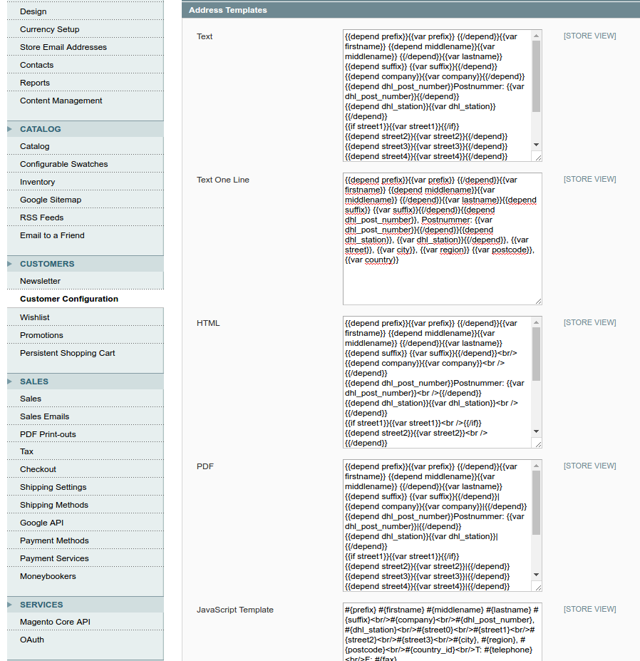

.. |date| date:: %d/%m/%Y
.. |year| date:: %Y

.. footer::
   .. class:: footertable

   +-------------------------+-------------------------+
   | Stand: |date|           | .. class:: rightalign   |
   |                         |                         |
   |                         | ###Page###/###Total###  |
   +-------------------------+-------------------------+

.. header::
   .. image:: images/dhl.jpg
      :width: 4.5cm
      :height: 1.2cm
      :align: right

.. sectnum::

=========================================================================
DHL Standortsuche Europa: Packstationen und Paketshops im Checkout wählen
=========================================================================

Die Versandsoftware Parcel Shop Finder ist ein von DHL bereitgestellter Service,
wodurch es möglich ist im Checkout Prozess eine DHL Abholstation zu wählen
und diese als alternative Lieferadresse zu wählen.

.. contents:: DHL Locationfinder - Endbenutzer-Dokumentation

.. raw:: pdf

   PageBreak

Voraussetzungen
===============

Folgende Voraussetzungen müssen für den reibungslosen Betrieb des DHL-LocationFinder-Moduls erfüllt sein.

Magento
-------

Folgende Magento-Versionen werden vom Modul unterstützt bzw. vorausgesetzt:

- Community-Edition 1.7, 1.8, 1.9

Server
------

- Auf dem Server sollte PHP in der Version 5.4.x oder 5.5.x installiert sein.

- Die SOAP-Extension muss auf dem Webserver installiert und aktiviert sein.

DHL-Locationfinder
------------------

Folgende DHL-Locationfinder-Daten müssen zur Konfiguration des Moduls vorliegen:

.. list-table:: Benötigte DHL-Locationfinder-Daten
   :widths: 4 2 6
   :header-rows: 1

   * - Konfiguration
     - Pflichtfeld / fakultativ
     - Kommentar
   * - Google Maps API Key
     - Pflichtfeld
     - Der API Key wird für alle neuen Webprojekte benötigt, da ansonsten die Google Map Api nicht genutzt werden kann.
   * - Beschränke Ergebnisse auf
     - fakultativ
     - Dieses Feld legt fest, wie viele Ergebnisse auf der Karte angezeigt werden, wobei 50 die maximale von DHL zurück
       kommende Menge darstellt.
   * - Fester Zoom-Faktor oder skalieren nach Ergebnissen
     - fakultativ
     - Dieses Feld legt fest, ob nach einer erfolgreiche Stationssuche ein festgelegter Zoom-Faktor auf die Karte
       angewandt wird, oder ob der Kartenausschnitt sich anhand der gefundenen Stationen ausrichtet.
   * - Zoom Faktor nach der Suche
     - fakultativ
     - Sofern in der vorherigen Konfiguration eingestellt wurde, dass nach der Suche ein fester Zoom-Faktor verwendet
       werden soll, kann dieser hier ausgewählt werden. Dabei sind Werte zwischen 9 und 15 möglich, wobei 15 der größte
       Zoom-Faktor ist.

.. raw:: pdf

   PageBreak

Installation und Konfiguration
==============================

Das Modul kann auf dem bevorzugten Weg installiert werden.

Während der Installation werden drei neue Attribute in das System integriert. Sie lauten 'dhl_post_number',
'dhl_station_type' und 'dhl_station'. Diese Attribute werden in die drei folgenden Tabellen hinzugefügt:
'sales_flat_quote_address', 'sales_flat_order_address' und 'eav_attribute'.

Nach der Installation existiert unter "System" -> "Konfiguration" -> "Zur Kasse" ein neuer Reiter "DHL Parcel Shop Finder".
Dieser enthält alle Modul relevanten Konfigurationen.

.. raw:: pdf

   PageBreak

Integration
===========

Direkt nach der Installation ist das Modul aktiv kann verwendet werden. Dabei sind Ausgaben während des Checkout
Prozesses bei der Versandadresse zu sehen.

Damit die neuen Attribute nach einer Bestellung auch im Zusammenhang der Bestellung zu sehen sind, müssen die
Adress-Templates angepasst werden. Eine initiale Anpassung wird bei der Installation des Modules bereits vorgenommen.
Sollten die Templates allerdings bereits verändert worden sein, müssen die neuen Attribute noch nachträglich angepasst
werden. Im folgenden Bild sind die Templates, nach der Anpassung durch die Installation des Modules zu sehen.

.. raw:: pdf

   PageBreak

An dieser Stelle nochmals die einzelnen Templates, für die Anpassung im System. Entscheidend für individuelle Templates
sind die neuen Felder, welche in den Template meist diese Form haben:

{{depend dhl_post_number}}Postnummer: {{var dhl_post_number}}|{{/depend}}
{{depend dhl_station}}{{var dhl_station}}|{{/depend}}

Text:

.. sourcecode:: php

   {{depend prefix}}{{var prefix}} {{/depend}}{{var firstname}} {{depend middlename}}{{var middlename}}
   {{/depend}}{{var lastname}}{{depend suffix}} {{var suffix}}{{/depend}}
   {{depend company}}{{var company}}{{/depend}}
   {{depend dhl_post_number}}Postnummer: {{var dhl_post_number}}{{/depend}}
   {{depend dhl_station}}{{var dhl_station}}{{/depend}}
   {{if street1}}{{var street1}}{{/if}}
   {{depend street2}}{{var street2}}{{/depend}}
   {{depend street3}}{{var street3}}{{/depend}}
   {{depend street4}}{{var street4}}{{/depend}}
   {{if city}}{{var city}}, {{/if}}{{if region}}{{var region}}, {{/if}}{{if postcode}}{{var postcode}}
   {{/if}}{{var country}}
   T: {{var telephone}}
   {{depend fax}}F: {{var fax}}{{/depend}}

Text One Line:

.. sourcecode:: php

   {{depend prefix}}{{var prefix}} {{/depend}}{{var firstname}} {{depend middlename}}{{var middlename}}
   {{/depend}}{{var lastname}}{{depend suffix}} {{var suffix}}{{/depend}}{{depend dhl_post_number}},
   Postnummer: {{var dhl_post_number}}{{/depend}}{{depend dhl_station}}, {{var dhl_station}}{{/depend}},
   {{var street}}, {{var city}}, {{var region}} {{var postcode}}, {{var country}}

HTML:

.. sourcecode:: php

   {{depend prefix}}{{var prefix}} {{/depend}}{{var firstname}} {{depend middlename}}{{var middlename}}
   {{/depend}}{{var lastname}}{{depend suffix}} {{var suffix}}{{/depend}} 
   {{depend company}}{{var company}} {{/depend}}
   {{depend dhl_post_number}}Postnummer: {{var dhl_post_number}} {{/depend}}
   {{depend dhl_station}}{{var dhl_station}} {{/depend}}
   {{if street1}}{{var street1}} {{/if}}
   {{depend street2}}{{var street2}} {{/depend}}
   {{depend street3}}{{var street3}} {{/depend}}
   {{depend street4}}{{var street4}} {{/depend}}
   {{if city}}{{var city}},  {{/if}}{{if region}}{{var region}}, {{/if}}{{if postcode}}{{var postcode}}
   {{/if}} {{var country}} 
   {{depend telephone}}T: {{var telephone}}{{/depend}}
   {{depend fax}} F: {{var fax}}{{/depend}}

.. raw:: pdf

   PageBreak

PDF:

.. sourcecode:: php

   {{depend prefix}}{{var prefix}} {{/depend}}{{var firstname}} {{depend middlename}}{{var middlename}}
   {{/depend}}{{var lastname}}{{depend suffix}} {{var suffix}}{{/depend}}|
   {{depend company}}{{var company}}|{{/depend}}
   {{depend dhl_post_number}}Postnummer: {{var dhl_post_number}}|{{/depend}}
   {{depend dhl_station}}{{var dhl_station}}|{{/depend}}
   {{if street1}}{{var street1}}{{/if}}
   {{depend street2}}{{var street2}}|{{/depend}}
   {{depend street3}}{{var street3}}|{{/depend}}
   {{depend street4}}{{var street4}}|{{/depend}}
   {{if city}}{{var city}},  {{/if}}{{if region}}{{var region}}, {{/if}}{{if postcode}}{{var postcode}}
   {{/if}}| {{var country}}|
   {{depend telephone}}T: {{var telephone}}{{/depend}}|
   {{depend fax}} F: {{var fax}}{{/depend}}

JavaScript Template:

.. sourcecode:: php

   #{prefix} #{firstname} #{middlename} #{lastname} #{suffix} #{company} #{dhl_post_number},
   #{dhl_station} #{street0} #{street1} #{street2} #{street3} #{city}, #{region},
    #{postcode} #{country_id} T: #{telephone} F: #{fax}

.. raw:: pdf

   PageBreak

Hinweise bei der Verwendung des Modules
=======================================

Erlaubte Länder
---------------

Derzeit werden von dem DHL Service Standortsuche Europa folgende Länder unterstützt:

- Österreich
- Belgien
- Tschechien
- Deutschland
- Niederlande
- Polen
- Slowakei

Somit sind auch nur maximal diese (je nach Shop-Konfiguration) als Auswahl im Checkout bei der Standortsuche verfügbar.

Übersetzungen
-------------

Alle Übersetzungen sind in den mitgelieferten CSV Dateien enthalten und somit auch durch lokale Übersetzungsdateien
anpassbar.

Verwendung von jQuery
---------------------

Die Erweiterung der Google Map API, der Store Locator, basiert auf dem JavaScript Framework jQuery. jQuery wird durch
die Template Datei 'dhl_locationfinder/page/html/head.phtml' eingebunden. Sofern der Store jQuery bereits einbindet,
kann ein lokales Template die Einbindung abändern. Für das standardmäßig in Magento CE 1.9 enthaltene Theme 'rwd'
wurde bereits eine angepasste Template-Datei hinterlegt, da das Theme jQuery bereits mitliefert.

Bearbeiten der Bestellung im Backend
------------------------------------

Da die Standorte von DHL kommen und sich theoretisch jederzeit in der Adresse oder verfügbarkeit ändern können,
wurde davon abgesehen die Lieferadressen mit ausgewählter Station für den Kunden abzuspeichern. Zuzüglich kann man die
Informationen über die Versandstation im Backend auch nicht anpassen.

Deaktivieren des Modules
------------------------

Sofern es gewünscht wird, das Modul zu deaktivieren, ohne es zu deinstallieren, kann man dies auf zwei verschiedene
Wege lösen.

1. Deaktivierung des Modules durch die 'app/etc/modules/Dhl_LocationFinder.xml' Datei. Darin den Wert für 'active' von
   true auf false abändern.

2. Deaktivieren der Frontend Ausgaben. Im Backend unter dem Menupunkt "System" -> "Konfiguration" -> "Erweitert"
   -> "Erweitert" -> "Deaktiviere Modulausgaben" können alle Ausgaben und die Einbindung der JavaScripte deaktiviert
   werden, wenn in der Zeile mit "Dhl_LocationFinder" der Wert "Aktiviert" auf "Deaktiviert" gesetzt wird.

.. raw:: pdf

   PageBreak

Abfrage über SOAP API
---------------------

Die neuen drei Attribute sind auch über die SOAP API abrufbar, wenn ein Aufruf alá "sales_order.info" statt findet.
