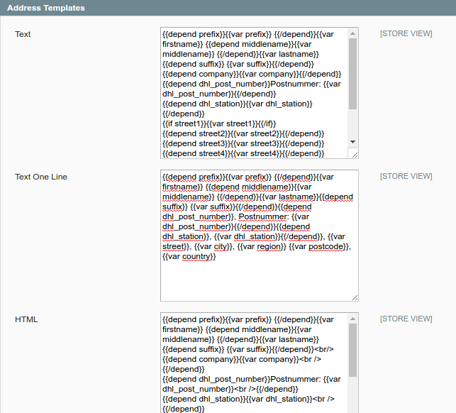
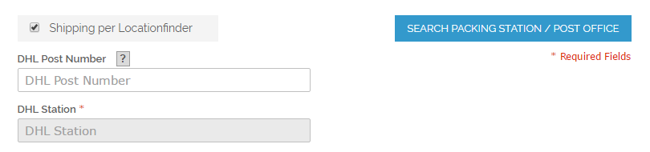
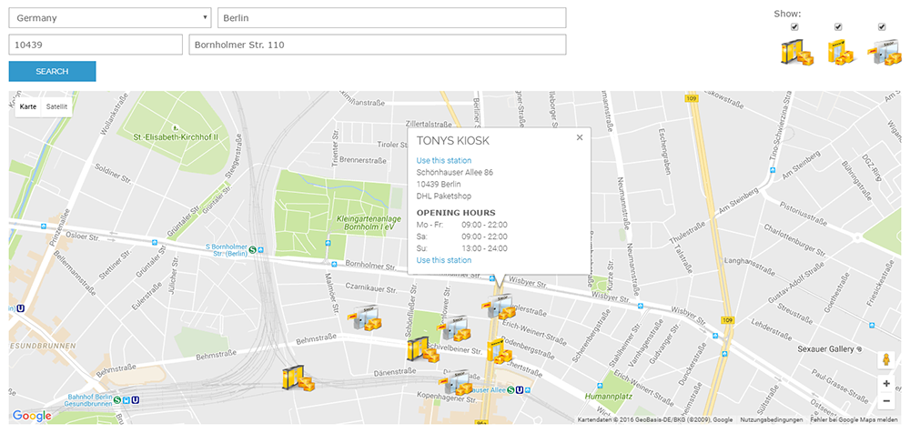

.. |date| date:: %d/%m/%Y
.. |year| date:: %Y

.. footer::
   .. class:: footertable

   +-------------------------+-------------------------+
   | As of: |date|           | .. class:: rightalign   |
   |                         |                         |
   |                         | ###Page###/###Total###  |
   +-------------------------+-------------------------+

.. header::
   .. image:: images/dhl.jpg
      :width: 4.5cm
      :height: 1.2cm
      :align: right

.. sectnum::

========================================================
DHL Locationfinder: Search Packstations and Parcel Shops
========================================================

The module *DHL_LocationFinder* allows using DHL Packstations, post offices,
and parcel shops / retail outlets as destination address in the Magento® checkout.
The module integrates the Location search API Europe (Standortsuche API Europa),
which is provided by DHL.

This is also called DHL Parcelshop Finder, Postfinder, Locationsearch Europe (Standortsuche Europa).

.. contents:: End user documentation

.. raw:: pdf

   PageBreak

Requirements
============

The following requirements must be met for the smooth operation of the module:

Magento®
--------

The following Magento® versions are supported:

- Community Edition 1.9
- Community Edition 1.8
- Community Edition 1.7

PHP
---

These PHP versions are supported:

- PHP 7.0
- PHP 5.6
- PHP 5.5

To connect to the API, the PHP SOAP extension must be installed and enabled on the web server.

Google API Key
--------------

The module uses Google Maps. To use it, a Google Maps API Key is required. Usually, a free key will
suffice, see also https://developers.google.com/maps/pricing-and-plans/#details

.. raw:: pdf

   PageBreak

Installation and configuration
==============================

This explains how to install and configure the module.

Installation
------------

Install the module's files according to your preferred setup / deployment strategy. Refresh the configuration cache
to apply the changes.

When the module is first executed, these new address attributes are created in your system:

- ``dhl_post_number``
- ``dhl_station_type``
- ``dhl_station``

The attributes are added in the following tables:

- ``sales_flat_quote_address``
- ``sales_flat_order_address``
- ``eav_attribute``

Module configuration
--------------------

After the installation, go to the configuration area:

::

    System → Configuration → Sales → Checkout

You will find a new config group "DHL Parcelshop Finder" there which contains all the relevant configuration.

.. list-table:: Configuration settings
   :widths: 4 2 6
   :header-rows: 1

   * - Configuration
     - required / optional
     - Comment
   * - Google Maps API Key
     - required
     - To show DHL locations in the checkout, the Google Maps API is used which requires an API key.
   * - Limit results
     - optional
     - This sets the number of results that are shown on the map. The Location search API Europe provides a maximum of
       50 locations.
   * - Zoom (auto or fixed)
     - required
     - This specifies if the map is zoomed automatically according to the results, or if a fixed zoom factor is used.
   * - Zoom factor (if fixed zoom selected)
     - Optional
     - If a fixed zoom factor should be used, the value can be defined here. Values between 9-15 are possible. 15 is
       the largest zoom factor.

.. raw:: pdf

   PageBreak

Integration of address templates
--------------------------------

The module introduces new address attributes. In order to see the new attributes in your system, you might have to add the
new attributes to your address templates.

::

    System → Configuration → Customers → Customer configuration → Address Templates

The following image shows the default templates provided by the module:

In case you have already made changes to this configuration, the address attributes need to be added manually to your
system configuration, e.g. like this:

::

    {{depend dhl_post_number}}Postnummer: {{var dhl_post_number}}|{{/depend}}
    {{depend dhl_station}}{{var dhl_station}}|{{/depend}}

.. raw:: pdf

   PageBreak

Text:

::

   {{depend prefix}}{{var prefix}} {{/depend}}{{var firstname}} {{depend middlename}}{{var middlename}}
   {{/depend}}{{var lastname}}{{depend suffix}} {{var suffix}}{{/depend}}
   {{depend company}}{{var company}}{{/depend}}
   {{depend dhl_post_number}}Postnummer: {{var dhl_post_number}}{{/depend}}
   {{depend dhl_station}}{{var dhl_station}}{{/depend}}
   {{if street1}}{{var street1}}{{/if}}
   {{depend street2}}{{var street2}}{{/depend}}
   {{depend street3}}{{var street3}}{{/depend}}
   {{depend street4}}{{var street4}}{{/depend}}
   {{if city}}{{var city}}, {{/if}}{{if region}}{{var region}}, {{/if}}{{if postcode}}{{var postcode}}
   {{/if}}{{var country}}
   T: {{var telephone}}
   {{depend fax}}F: {{var fax}}{{/depend}}

Text One Line:

::

   {{depend prefix}}{{var prefix}} {{/depend}}{{var firstname}} {{depend middlename}}{{var middlename}}
   {{/depend}}{{var lastname}}{{depend suffix}} {{var suffix}}{{/depend}}{{depend dhl_post_number}},
   Postnummer: {{var dhl_post_number}}{{/depend}}{{depend dhl_station}}, {{var dhl_station}}{{/depend}},
   {{var street}}, {{var city}}, {{var region}} {{var postcode}}, {{var country}}

HTML:

::

   {{depend prefix}}{{var prefix}} {{/depend}}{{var firstname}} {{depend middlename}}{{var middlename}}
   {{/depend}}{{var lastname}}{{depend suffix}} {{var suffix}}{{/depend}} 
   {{depend company}}{{var company}} {{/depend}}
   {{depend dhl_post_number}}Postnummer: {{var dhl_post_number}} {{/depend}}
   {{depend dhl_station}}{{var dhl_station}} {{/depend}}
   {{if street1}}{{var street1}} {{/if}}
   {{depend street2}}{{var street2}} {{/depend}}
   {{depend street3}}{{var street3}} {{/depend}}
   {{depend street4}}{{var street4}} {{/depend}}
   {{if city}}{{var city}},  {{/if}}{{if region}}{{var region}}, {{/if}}{{if postcode}}{{var postcode}}
   {{/if}} {{var country}} 
   {{depend telephone}}T: {{var telephone}}{{/depend}}
   {{depend fax}} F: {{var fax}}{{/depend}}

PDF:

::

   {{depend prefix}}{{var prefix}} {{/depend}}{{var firstname}} {{depend middlename}}{{var middlename}}
   {{/depend}}{{var lastname}}{{depend suffix}} {{var suffix}}{{/depend}}|
   {{depend company}}{{var company}}|{{/depend}}
   {{depend dhl_post_number}}Postnummer: {{var dhl_post_number}}|{{/depend}}
   {{depend dhl_station}}{{var dhl_station}}|{{/depend}}
   {{if street1}}{{var street1}}{{/if}}
   {{depend street2}}{{var street2}}|{{/depend}}
   {{depend street3}}{{var street3}}|{{/depend}}
   {{depend street4}}{{var street4}}|{{/depend}}
   {{if city}}{{var city}},  {{/if}}{{if region}}{{var region}}, {{/if}}{{if postcode}}{{var postcode}}
   {{/if}}| {{var country}}|
   {{depend telephone}}T: {{var telephone}}{{/depend}}|
   {{depend fax}} F: {{var fax}}{{/depend}}

JavaScript Template:

::

   #{prefix} #{firstname} #{middlename} #{lastname} #{suffix} #{company} #{dhl_post_number},
   #{dhl_station} #{street0} #{street1} #{street2} #{street3} #{city}, #{region},
    #{postcode} #{country_id} T: #{telephone} F: #{fax}

.. raw:: pdf

   PageBreak

Hints for using the module
==========================

Allowed Countries
-----------------

The following countries are currently supported by the Location search API Europe:

- Belgium
- Germany
- Netherlands
- Austria
- Poland
- Slovakia
- Czech Republic

Therefore, for the location search in the checkout, only these countries are available (or fewer, depending
on the shop configuration).

Language support
----------------

The module supports the locales ``en_US`` and ``de_DE``. The translations are stored in the CSV translation
files and can therefore be modified by third-party modules.

Use of jQuery
-------------

The module uses the Google Maps Plugin *Store Locator* which is based on the JavaScript library jQuery. This
library will be included by the template file ``dhl_locationfinder/page/html/head.phtml``.

However, jQuery will *not* be included if you are using the *RWD* theme.
If you are using a custom theme that already includes jQuery, please include the
file ``rwd/default/template/dhl_locationfinder/page/html/head.phtml`` into your own theme.

.. raw:: pdf

   PageBreak

Magento® API
------------

The address attributes created by the module are available to third-party systems via the Magento® API.

SOAP V2
~~~~~~~

::

    $result = $proxy->salesOrderInfo($sessionId, $incrementId);
    var_dump($result->shipping_address);

SOAP V2 (WS-I Compliance Mode)
~~~~~~~~~~~~~~~~~~~~~~~~~~~~~~

::

    $result = $proxy->salesOrderInfo((object)array(
        'sessionId' => $sessionId->result,
        'orderIncrementId' => $incrementId,
    ));
    var_dump($result->result->shipping_address);

REST
~~~~

::

    curl --get \
        -H 'Accept: application/xml' \
        -H 'Authorization: [OAuth Header] \
        "https://magentohost/api/rest/orders/:orderid/addresses"

Please note that the new attributes must explicitly be enabled for REST-API calls.
To do this, go to:

::

    System → Web Services → REST → Attributes

.. image:: images/rest-attributes.png
   :width: 50%
   :align: left

.. raw:: pdf

   PageBreak

Frontend functionality
======================

Magento® Checkout
-----------------

- Go to the checkout as usual, according to the Magento® standard
- In the checkout step *Billing address*, enter your billing address
- Select *Ship to different address* and click *Continue*

.. image:: images/en-checkout-step-001.png
   :width: 5.0cm

Magento® Checkout: Shipping address
-----------------------------------

- If you are already logged in and you see the dropdown with your stored addresses, please select *New address*
- Activate the checkbox *Shipping per Locationfinder*
- When the checkbox is activated, the additional fields *DHL Post Number* and *DHL Station* and the button *Search Pack Station / Post Office* become visible
- Open the DHL Location Map by clicking *Search Pack Station / Post Office*

DHL Location Map: Initial result and new location search
--------------------------------------------------------

- The initial result you see is based on the previously entered billing address
- The number of shown locations and the zoom factor can be defined in the `Module configuration`_
- You can change the address as you wish and search again via the button *Search*
- For a successful search, you need at least *country, city*, or for an extended search
  either *country, city, ZIP* or *country, city, ZIP, street, and house number*
- The dropdown field *country* depends on your system configuration for ``general_country_default`` and ``general_country_allow``

.. image:: images/en-checkout-step-002-map-invoiceaddress.png
   :width: 16.5cm

DHL Location Map: Filtering the search results
----------------------------------------------

- By enabling or disabling the checkboxes you can filter the result to show only *Pack Stations*, *Post Offices* or *Parcel Shops*

.. image:: images/en-checkout-step-002-map-invoiceaddress-filtered.png
   :width: 16.5cm

.. raw:: pdf

   PageBreak

DHL Location Map: Additional information and selecting a location
-----------------------------------------------------------------

- With a *single click* on a location icon you get additional information about that location
- For Pack Stations: Pack Station number and address
- For Post Offices and Parcel Shops: name, address, opening hours, services
- By clicking the hyperlink *Use this station* the location can be selected; the DHL Location map will be closed afterwards
- With a *double-click* on the location icon you can directly select the location. The map will be closed immediately.

.. raw:: pdf

   PageBreak

Magento® Checkout: Shipping address - check your data
-----------------------------------------------------

- The location data for the *Pack Station*, *Post Office* or *Parcel Shop* have been entered now. You cannot edit these fields manually
- To select another DHL location, open the DHL Location Map again by clicking *Search Pack Station / Post Office*
- If you have selected a *Pack Station*, you must enter your personal *DHL Post Number* (required field)
- When selecting a *Post Office* or *Parcel Shop*, your personal *DHL Postnummer* is not required (but can still be entered)
- Continue the checkout process as usual (Magento® standard behaviour)

.. image:: images/en-checkout-step-003-packstation-data.png
   :width: 16.5cm

Magento® Checkout: Additional hints
-----------------------------------

- The addresses of *Pack Stations*, *Post Offices*, or *Parcel Shops* cannot be stored in the customer's address book
- If you decide to enter your billing address in the checkout step *Shipping address*, please disable the checkbox *Shipping per Locationfinder* first

.. raw:: pdf

   PageBreak

Uninstalling or disabling the module
====================================

To *uninstall* the module, follow these steps:

1. Delete all module files from your file system
2. Remove the address attributes mentioned in the section `Installation`_
3. Remove the module entry ``dhl_locationfinder_setup`` from the table ``core_resource``.
4. Remove all module entries ``checkout/dhl_locationfinder/*`` from the table ``core_config_data``.
5. Flush the cache afterwards.

In case you only want to *disable* the module without uninstalling it, you have two options:

1. Disable the module completely

   The module will not be loaded if the node ``active`` in the file
   ``app/etc/modules/Dhl_LocationFinder.xml`` is set from **true** to **false**
2. Disable module output

   The module's output will not be visible if you disable it in the system configuration. However, the module will still be loaded.

   ::

       System → Configuration → Advanced → Advanced → Disable Modules Output → Dhl_LocationFinder

Technical support
=================

In case of questions or problems, please have a look at the Support Portal (FAQ) first: http://dhl.support.netresearch.de/

If the problem cannot be resolved, you can contact the support team via the Support Portal or by sending an
email to dhl.support@netresearch.de
